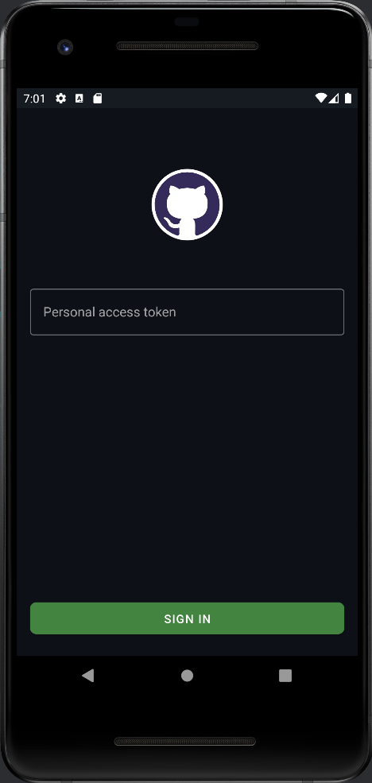

# EasyGitGub

### Functional requirements

1. User authorization (personal access token)
2. Viewing the list of user repositories (first 10)
3. View detailed information of the selected repository
	statistics (forks, stars, watchers)
	link to the repository web page
	license
	readme
### Technical requirements

1. Implementation on Kotlin
2. Use XML Layouts for UI
3. Use Kotlin Gradle DSL
4. Use Retrofit to work with the REST API
5. Use RecyclerView to display the list
6. Use ConstraintLayout for detailed information screen
7. Use Android Navigation Component to navigate between screens
8. Use View Binding to link the layout to the code
9. Screens are made using Fragment (Single Activity approach)
10. Use Coroutines for asynchrony and multithreading
11. Use Kotlinx.Serialization for json parsing
12. Use ViewModel to implement the logic of screens
13. Use LiveData/StateFlow to update data on UI
14. Use Dagger Hilt for dependency injection
15. Save the authorization token in the device storage - SharedPreferences
16. Correctly handle the situations "data loading", "loading error", "empty list"
17. Correctly handle the configuration change
18. When restarting the application, the authorization must be saved
19. Use localization for all strings shown to the user
20. Use vector graphics wherever possible
21. Provide support for Android API 21

### Application graph

### Developer's Note
The chronology of the development of the test project is available by branch numbers. Branches related to this application start with GB"id"/feature/"feauture-name". The application was developed with the condition that it would be covered with the maximum number of tests if necessary, for this you just need to write fakes for data sources.

### Application Image

 
 
 

